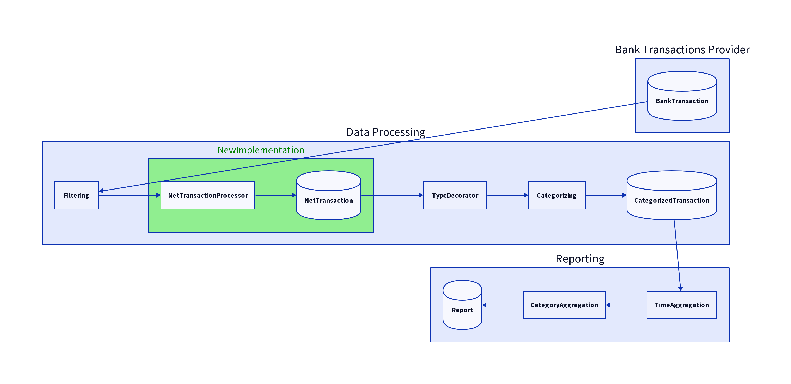
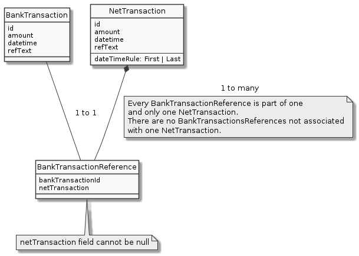

# Net Transaction

# Net Transactions (to be implemented)

The idea of net transactions is to group `BankTransaction` into a new
resource called `NetTransaction`, so that multiple `BankTransactions`
can be treated as a single atomic transaction by further processing
features. This is specially useful for a couple of use cases:

1.  **Purchase-Refund**: Online of physical purchases sometimes are
    wrongly made and they can be entirely or partially refunded. These
    are reflected as multiple bank transactions adding noise to
    analysis, specially if these transactions are split across
    categories or different time periods. A single \`NetTransaction\`
    with the net amount of the purchase after refund, can provide
    cleaner analysis and understanding of the data.
2.  **Bill-Sharing**: Similar to refunds, sometimes bills are split
    among multple people and a single person pays the total amount,
    afterwards other people transfer a partial amount to the payer.
    \`NetTransaction\`s in this case offer a significant cleaner view of
    the data here.

## Data Model

`NetTransactions` should be compatible with `BankTransactions` so that
all further processing layers can transparently process both
inter-changeably. `NetTransactions` can be viewed as a set partition of
the set of all `BankTransactions`, so that every `BankTransaction` is
associated with one, and only one, `NetTransaction`. Since
`NetTransactions` are possibly related to many `BankTransactions`,
determining the `datetime` for a single `NetTransaction` requires
defining a rule to choose a datetime using related `BankTransactions`
datetimes.

## NetTransaction processor

In order to implement the `NetTransaction` set partitioning logic, user
input is needed\[1\] to determine which `BankTransactions` are part of a
single `NetTransaction`. There are two main ways of collecting this data
from users:

1.  Ask users to annotate transactions they want in their Bank App using
    a particular annotation (e.g. prefix "\&net-"). This is currently
    done for the category feature.
      - Pro: Bank App UI's offer good user experience for annotating
        transactions.
      - Con: Since this is free-text, users would have to comply with a
        particular annotation logic.
      - Con: Users would have to revise their annotation carefully to
        avoid duplicates. An API for querying existing annotations would
        be needed.
      - Con: Adding `dateTimeRule` for each annotation would be a
        nightmare.
2.  Create a separate `BankTransactionReference` database, to be
    populated by the user through APIs. Users would only have to insert
    `BankTransactionReference` for linked `BankTransactions`.
      - Pro: Avoids user free-text, therefore provides data consistency.
      - Pro: Any metadata associated with `NetTransactions` would be
        natural to add, for example `dateTimeRule` for each individual
        `NetTransaction`.
      - Con: There's no infra in the current codebase for API and/or UI.
      - Con: Two UX challenges: 1. helping the user identify which
        `BankTransaction` to annotate, without a UI, some additional API
        endpoints like "what are the all positive expenses" would be
        needed. 2. after identifying, the user would have to type
        individual `BankTransaction` id's to populate the DB.

Number 1 adds value in a shorter-term and number 2 is the right
long-term choice. Given that number 1 is not incremental towards number
2 (data migration would be needed) and number 1 would also require some
data query API, going for number 2 is a sensible decision.

[^user_input]: The assumption here is automatic partitioning logic wouldn't be accurate enough, maybe with a more robust database we could start playing with automating that for users.
